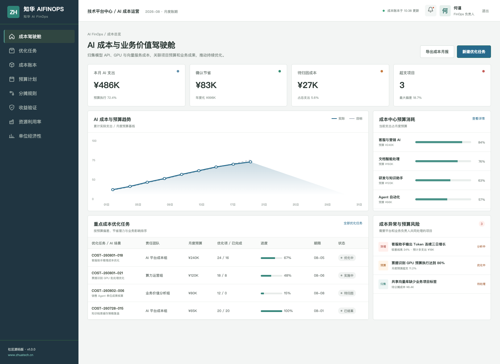
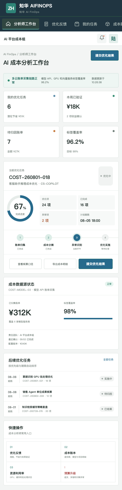

# ZhuaTech AI FinOps

AI 成本不应只是一张云账单。本项目把模型 Token、GPU、向量服务等技术成本分摊到业务项目，并进一步观察每次对话、每份文档或每个业务成果的单位成本。

**发布方：上海如静知华信息科技有限公司（知华科技）** · [官方网站 https://www.zhuatech.cn/](https://www.zhuatech.cn/)

## 你可以用它做什么

| 看清成本 | 控制预算 | 验证价值 |
| --- | --- | --- |
| 统一归集模型 API、GPU 和共享服务账单 | 预算阈值、异常波动和滚动预测 | 将节省金额与质量、效率和业务成果关联 |
| 按提供商、模型、环境、项目和团队切分 | 发起优化任务并跟踪责任人与截止日期 | 计算单位成果成本并完成账期复核 |

项目内置 `POST /api/shopfloor/cost-allocation`，使用精确金额计算把输入 Token、输出 Token 与 GPU 分别计价，输出总成本、预算利用率和优化建议。该实现完全本地运行，不需要外部 AI API Key。

## 管理端：成本与预算驾驶舱



面向 FinOps 负责人，突出预算执行、已确认节省、成本中心负荷和需要处理的异常账单。

## H5：成本分析师工作台



分析师可查看优化任务、成本账本、资源利用率，并提交优化结果和预算升级。

## 技术与数据

- 后端：Java 21、Spring Boot、Spring Security、JWT、JPA、Flyway
- 前端：Vue 3、Pinia、Vue Router、Axios、Vite
- 数据库：MySQL 8；自动化测试使用 H2
- 交付：Docker Compose、Nginx、响应式管理端与 H5
- Java 包：`cn.zhuatech.aifinops`

仓库演示价格、账单、人员及项目均为虚构数据，不代表任何服务商实际价格。

## 快速体验

```bash
cd frontend
npm install
npm run dev:demo
```

浏览器访问 `http://localhost:5173`。管理端：`planner / Demo@2026`；分析师端：`operator / Demo@2026`。后端 API 与容器方案见 [docs/api.md](docs/api.md)和 [deploy/README.md](deploy/README.md)。

## 许可及商业授权

本工程仅限个人学习、研究和非商业技术交流，**不得直接或间接商用**。如需企业内部部署、生产使用、SaaS、客户交付、收费培训、咨询服务、品牌替换或商业再发行，必须取得上海如静知华信息科技有限公司书面授权。法律条款以 [LICENSE](LICENSE) 为准。

如需 AI 成本治理咨询、多云账单集成、成本优化或深度开发定制，请联系知华科技：

| AI FinOps 咨询 | 商业授权及定制 |
| --- | --- |
|  |  |

[访问知华科技官网](https://www.zhuatech.cn/) · SEO 关键词：AI FinOps、AI 成本管理、Token 成本、GPU 成本、LLM 成本治理、AI 单位经济性、Java FinOps、知华科技。

## AI 支出异常预测

新增 `POST /api/aifinops/insights/spend-anomaly`。接口将当日消耗与历史日均基线对比，同时按剩余天数预测月度支出，并结合缓存命中率与预算使用率返回 `NORMAL`、`OPTIMIZE` 或 `THROTTLE`，帮助团队在超预算前采取模型路由、缓存或限流措施。

## 调用前预算预占

`POST /api/aifinops/insights/budget-reservations` 在模型调用前实施租户预算预占、幂等重放、软硬限额、并发控制和降本路由；成功预占可通过 `DELETE` 接口释放，避免并发调用穿透月度预算。详见[预算预占说明](docs/ENTERPRISE_BUDGET_RESERVATION.md)。
